# Lane Flowcharts: One per Raw Data Type

Operational flowcharts for every source type in the taxonomy (doc 01).
Rendered natively by GitHub (Mermaid). Each chart encodes the lane's docs +
GPs; chart titles link back to the governing doc.

## 0. Master routing — every raw file enters here

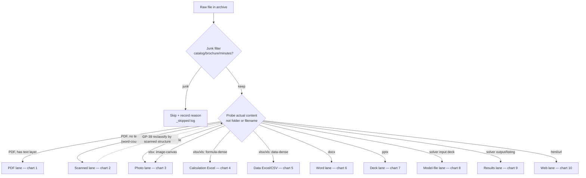

## 1. Born-digital PDF (standards / codes / papers) — [docs 01–03]

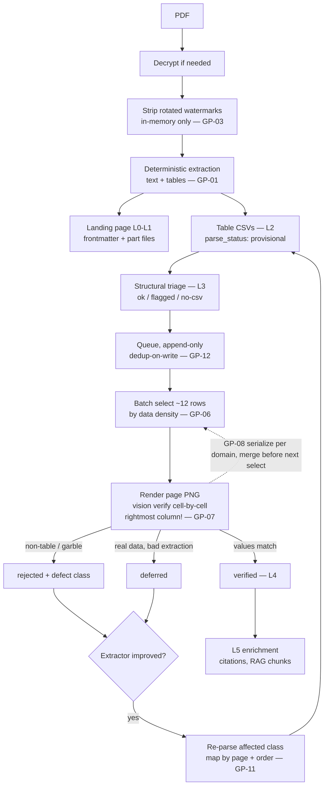

## 2. Scanned document — [doc 11]

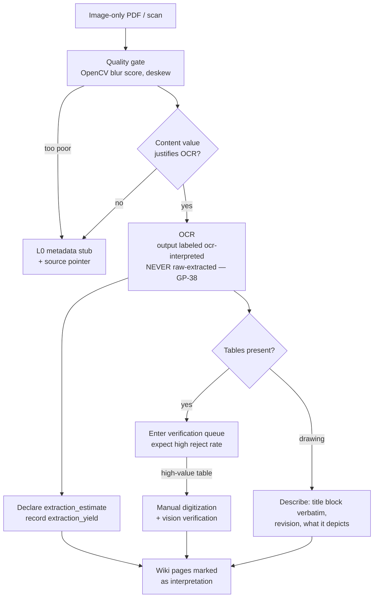

## 3. Photograph — [doc 11]

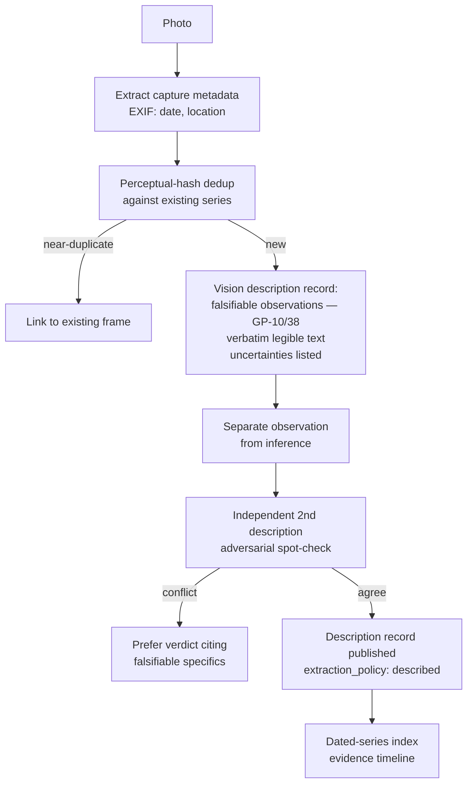

## 4. Calculation Excel — [doc 09]

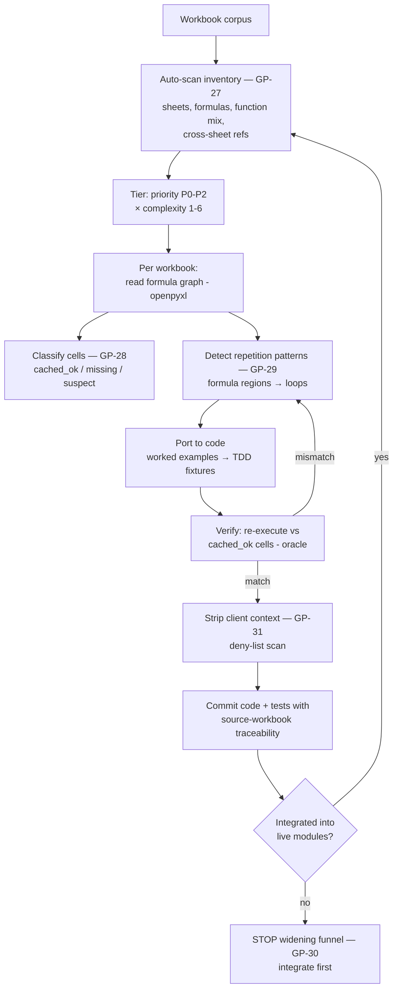

## 5. Data Excel / CSV / delimited — [doc 10]

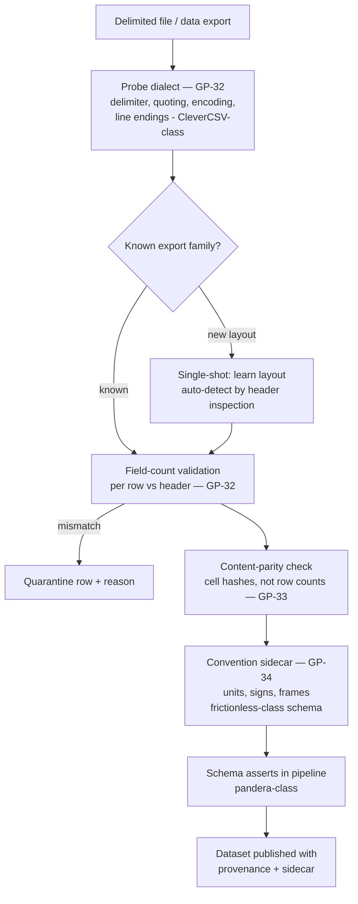

## 6. Word report / specification — [doc 09]

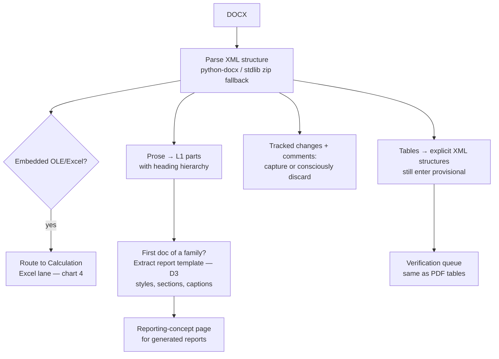

## 7. PowerPoint deck — [doc 09]

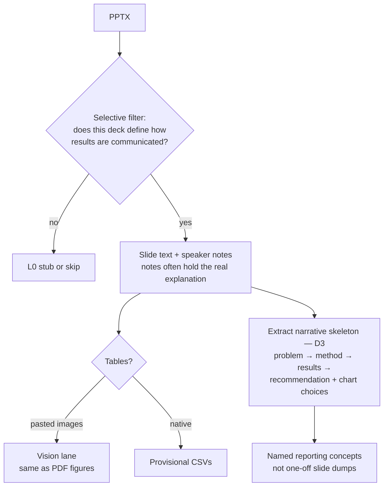

## 8. Solver input deck — [doc 10]

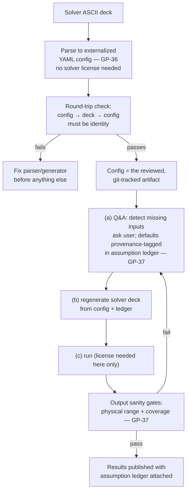

## 9. Solver output / results listing — [doc 10]

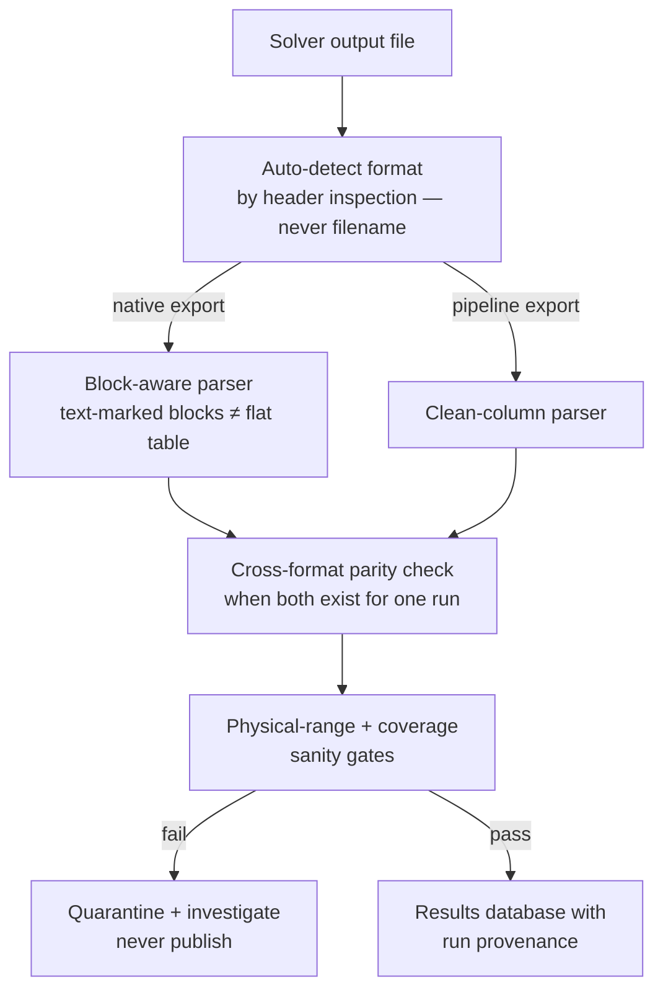

## 10. Web article / post — [doc 01]

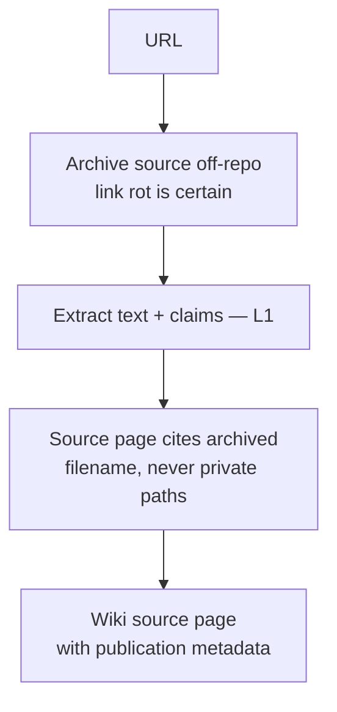

---

### Reading the charts

- **Every lane ends in a labeled trust state** — nothing is published
  without `verified` / `described` / `ocr-interpreted` / sidecar provenance.
- **Dashed edges** are the discipline rules that exist because a batch broke
  without them (the GP references).
- The master router (chart 0) is itself GP-04: classify by probed content,
  never by folder, filename, or extension alone.
